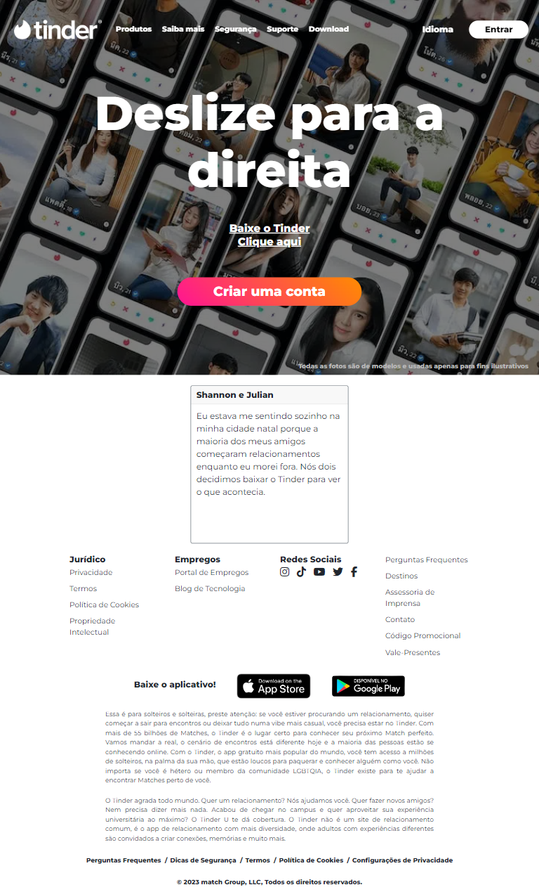

# Tinder Clone

Responsive project, mobile first, developed in HTML, CSS, Bootstrap.
Challenge proposed by "Imã Tech" and "MXM Sistemas", SharpCoders2 Program.  
Developed in December, 2023.  
Support by [Ralf Lima](https://ralflima.com/).

## Table of contents

- [Overview](#overview)
  - [The challenge](#the-challenge)
  - [Screenshot](#screenshot)
  - [Links](#links)
- [My process](#my-process)
  - [Built with](#built-with)
- [Author](#author)

## Overview

### The challenge

Users should be able to:

- View the optimal layout for the site depending on their device's screen size 
- See hover states for all interactive elements on the page

### Screenshot

### Links

- [Solution URL here](https://github.com/renato-albuquerque/tinder-clone)
- [Live Site URL here](https://renato-albuquerque.github.io/tinder-clone/)

## My process

### Built with

- Semantic HTML5 markup
- CSS custom properties
- Flexbox
- Mobile-first workflow
- Bootstrap

## Author

- Business Card - [Renato Albuquerque](https://rma-contacts.vercel.app/)
- Linkedin - [renato-malbuquerque](https://www.linkedin.com/in/renato-malbuquerque/)
- Discord - [Renato Albuquerque#0025](https://discordapp.com/users/992621595547938837)

